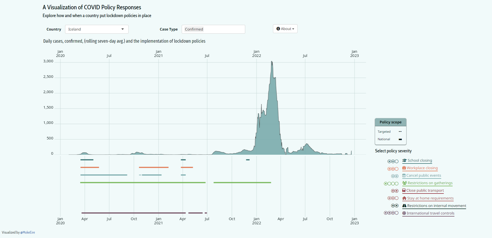

An old project that contrasts the lockdown policies employed by different countries with their COVID-19 case data.
Looking back, it's painfully hacky.
I was doing a lot of HTML and CSS learning and really wanted to mess around with pure HTML/CSS solutions which resulted in the cool but quirky design of the policy severity selection buttons. 

Johns Hopkins updated the data structure of their [COVID case data](https://github.com/CSSEGISandData/COVID-19) some time after I built the app so I had to rework the data transformations. 
Sadly, the axes stopped aligning for countries (seems like it only works properly for those with <10k cases/day e.g. Iceland) and I haven't had the time to fix it. 

[Project page](https://m-barrett.shinyapps.io/COVID-LockdownPolicies/)

:::{.column-page style="text-align:center;"}
*Click to expand*

:::